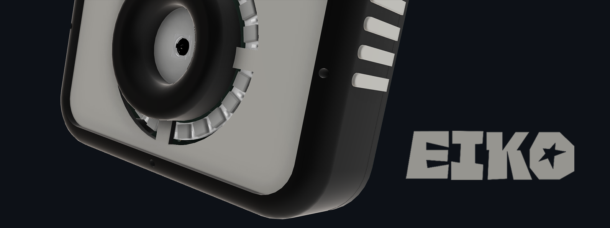
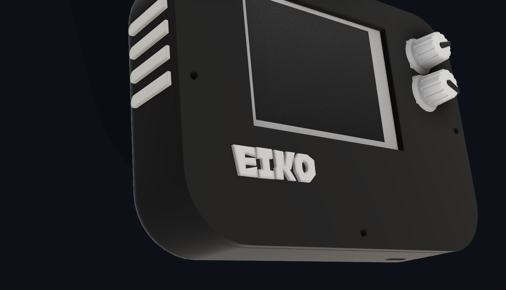
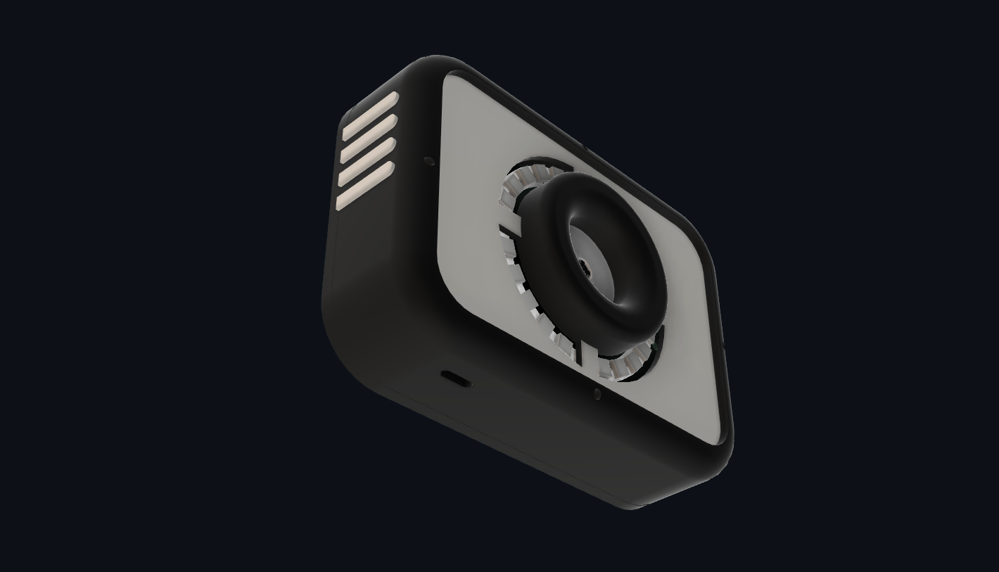
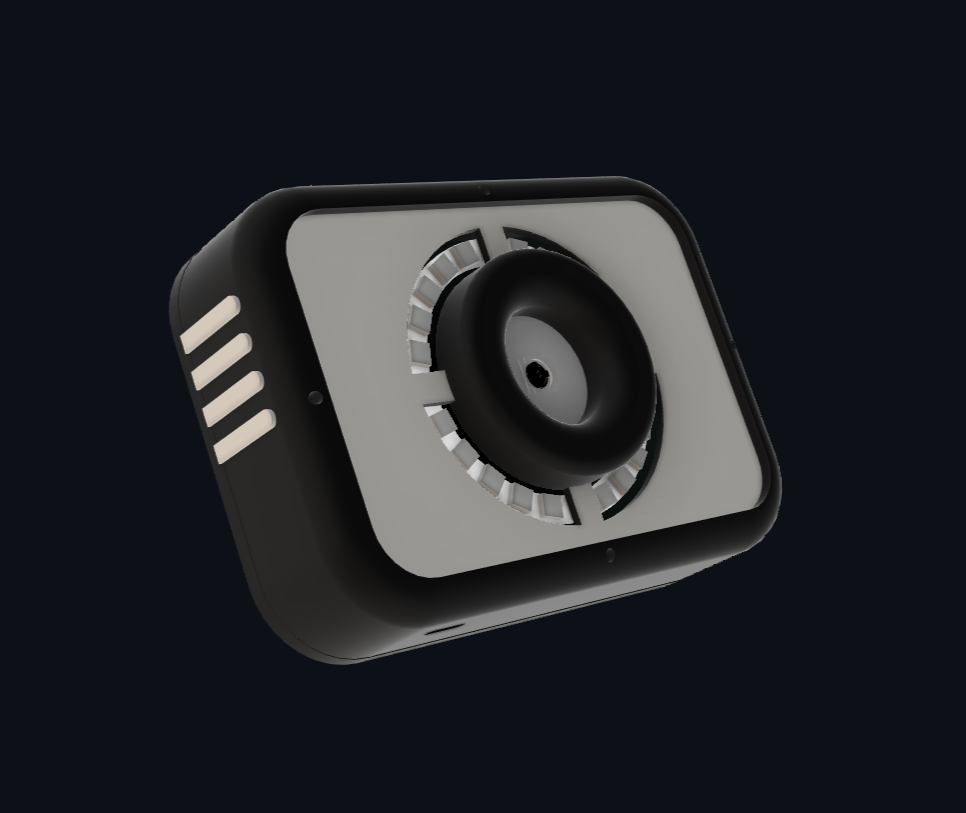

> *a camera built with the Orange Pi CM4, with rotary encoders, a TFT screen and 24-LED RGB ring.*

---
## What is this?

Eiko is a handheld camera built from scratch, with the Orange Pi CM4.

It takes photos, has a TFT screen and a 24-LED RGB ring around the lens that you can change colors with a rotary encoder.
|   |   |
|---|---|
||

## features

- live preview on a 2.8" TFT
- full res JPEG capture (using an 8MP IMX219 camera)
- rgb led ring for colorful lighting & flash
- two rotary encoders (one shoots, one controls the leds)
- saves to SD card

## PCB

## Cad

| Case Front | Case Back | Plate |
|---|---|---|
| | | |

## Firmware
You can find the firmware [here](https://github.com/niyikes/eiko-cam/tree/main/firmware)
| Input | Action |
|-------|--------|
| Rotate enc1 | Navigate menu |
| Press enc1 | Shutter/Click picture |
| Press enc2 | Toggle LED ring on/off |
| Rotate enc2 | Change LED color |

## BOM
| Component | Qty | Price (INR) | Total (INR) | Total (USD) | Source |
|-----------|-----|-------------|-------------|-------------|--------|
| Orange Pi CM4 | 1 | 6095 | 6095 | 64.50 | [crazypi.com](https://www.crazypi.com/Orange-Pi-Compute-Module-4) |
| TP4056 LiPo Charger | 1 | 184 | 184 | 1.95 | [robu.in](https://robu.in/product/tp4056-3-7v-lithium-battery-charging-module-1a-usb-type-c-port-ph2-0-terminal/) |
| USB-C Receptacle | 1 | 280 | 280 | 2.96 | [robu.in](https://robu.in/product/usb4745-03-a-gct-usb-sealed-connector-top-mount-usb-type-c-usb-3-2-receptacle-24-position/) |
| MT3608 Boost Converter | 1 | 20 | 20 | 0.21 | [robu.in](https://robu.in/product/mt3608-xian-aerosemi-tech-boost-type-adjustable-2a-2v24v-sot-23-6-dc-dc-converters-rohs/) |
| MicroSD Storage Board | 1 | 389 | 389 | 4.12 | [robu.in](https://robu.in/product/waveshare-micro-sdtf-storage-board/) |
| Alps EC11E Rotary Encoder | 2 | 415.24 | 830.48 | 8.79 | [element14.com](https://in.element14.com/alps/ec11e15204a3/encoder-vertical-30-det-15ppr/dp/1520804) |
| IMX219 Camera | 1 | 3659 | 3659 | 38.72 | [robu.in](https://robu.in/product/arducam-8mp-imx219-camera-module-with-fisheye-lens-for-jeson-nano-and-raspberry-pi-compute-module/) |
| WS2812 24-LED Ring | 1 | 131 | 131 | 1.39 | [robu.in](https://robu.in/product/24-bit-ws2812-5050-rgb-led-built-full-color-driving-lights-circular-development-board/) |
| 2.8" SPI TFT | 1 | 869 | 869 | 9.20 | [robu.in](https://robu.in/product/2-8-inch-spi-touch-screen-module-tft-interface-240320/) |
| 100nF Cap | 1 | 4.64 | 4.64 | 0.05 | [robu.in](https://robu.in/product/100nf-400v-dip-polyester-film-capacitor-pitch10mm/) |
| 1.2k Resistor | 2 | 1.18 | 2.36 | 0.02 | [sharvielectronics.com](https://sharvielectronics.com/product/1-2k-ohm-1-2-watt-resistor-5-tolerance/) |
| 10k Resistor | 5 | 0.45 | 2.25 | 0.02 | [sharvielectronics.com](https://sharvielectronics.com/product/10k-ohm-1-4-watt-resistor-5-tolerance/) |
| 100k Resistor | 2 | 0.45 | 0.90 | 0.01 | [sharvielectronics.com](https://sharvielectronics.com/product/100k-ohm-1-4-watt-resistor-5-tolerance/) |
| 13k Resistor | 2 | 1.08 | 2.16 | 0.02 | [robu.in](https://robu.in/product/mf25-13k-multicomp-pro-through-hole-resistor-13-kohm-mf25-series-250-mw/) |
| LiPo Battery | 1 | 329 | 329 | 3.48 | [robu.in](https://robu.in/product/nova-103450-2000mah-3-7v-lipo-battery-pack/) |
| M2.5 Screws | 10 | 1.24 | 12.40 | 0.13 | [onlyscrews.in](https://onlyscrews.in/products/m2-5-x-6mm-phillips-pan-head-ss-304-screw) |
| Heat Set Inserts | 10 | 2.50 | 25.00 | 0.26 | [flyrobo.in](https://www.flyrobo.in/m2.5-x-5mm-brass-heat-set-threaded-round-insert-nut) |
| **TOTAL** | | | | **$135.45** | |

I loved making this project, it was super fun and i learnt a LOT in the process. SUPER HAPPY WITH HOW IT TURNED OUT! :D

   
made with <3 by nia