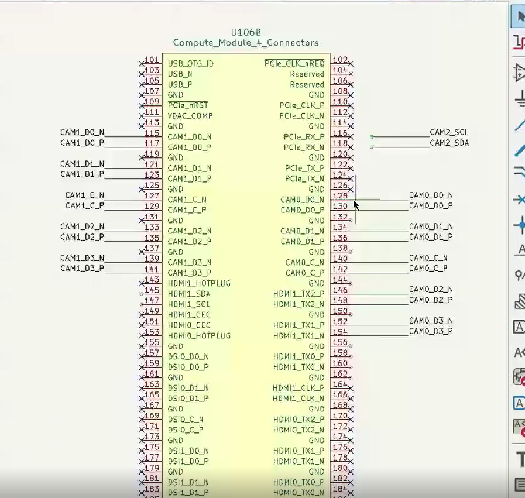
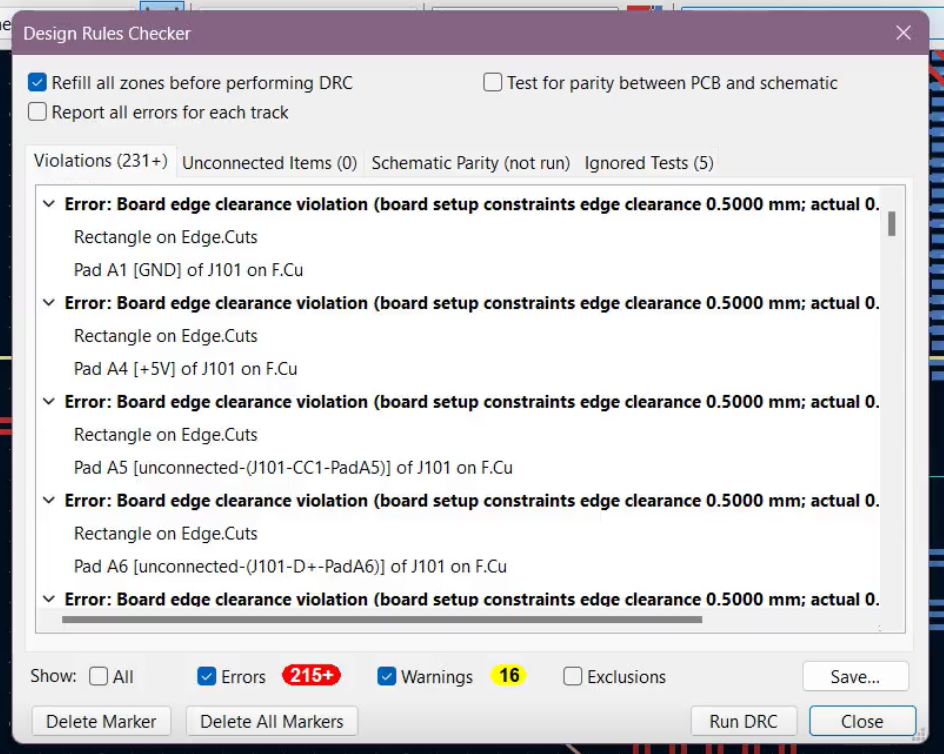
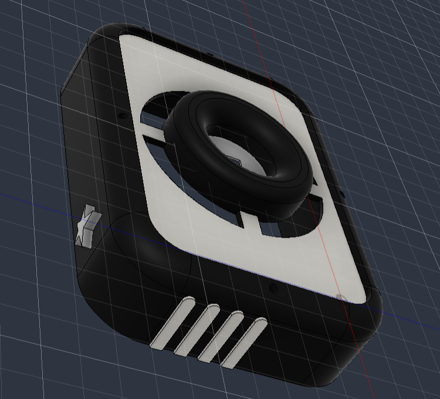
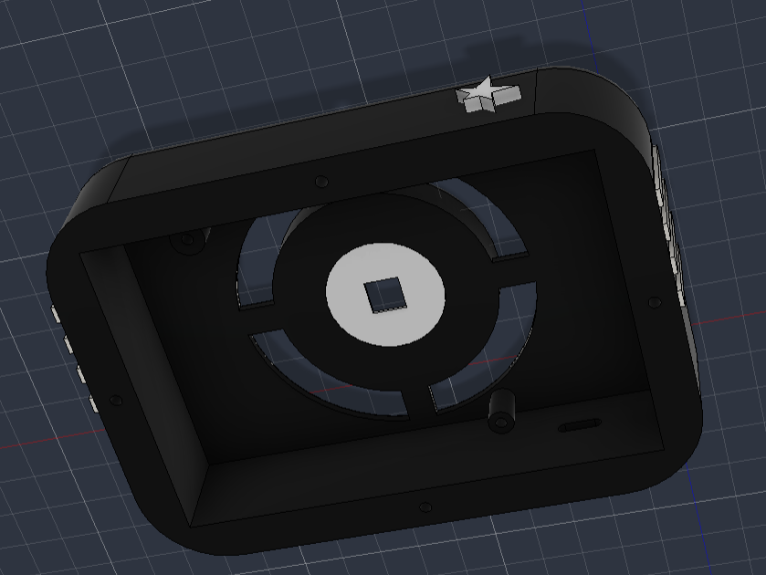
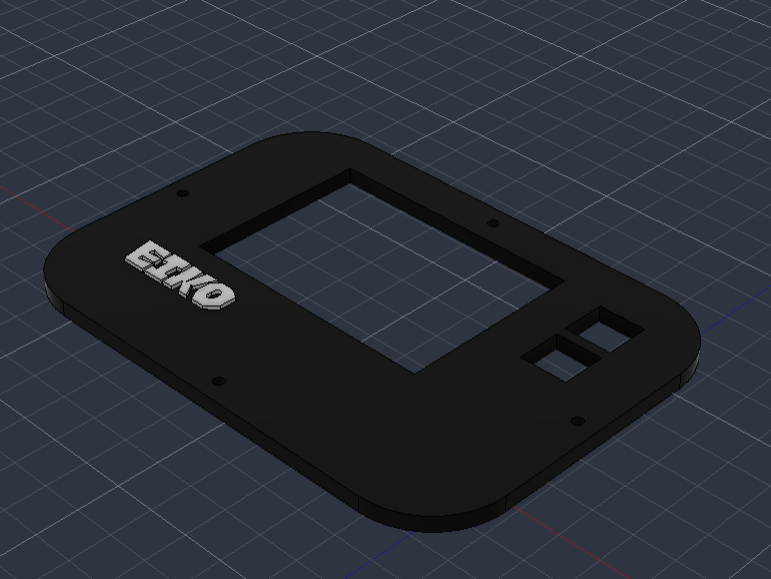
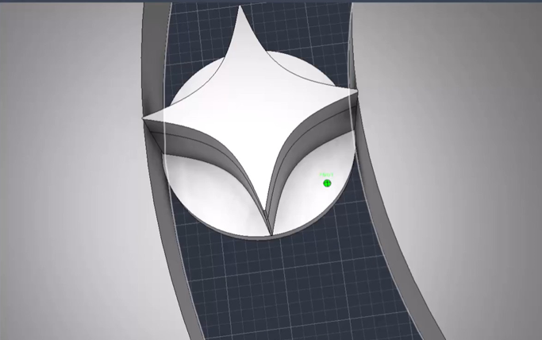
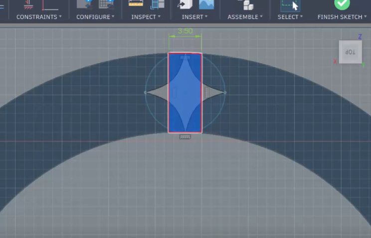
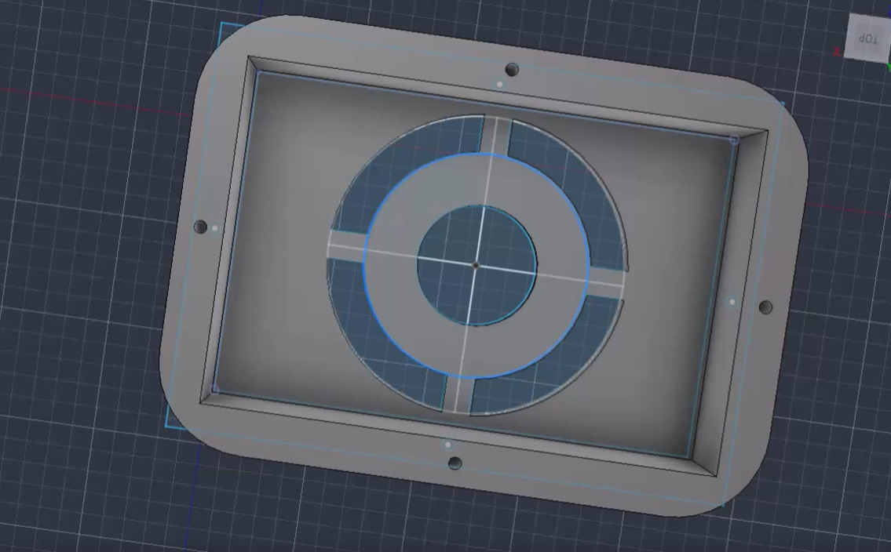
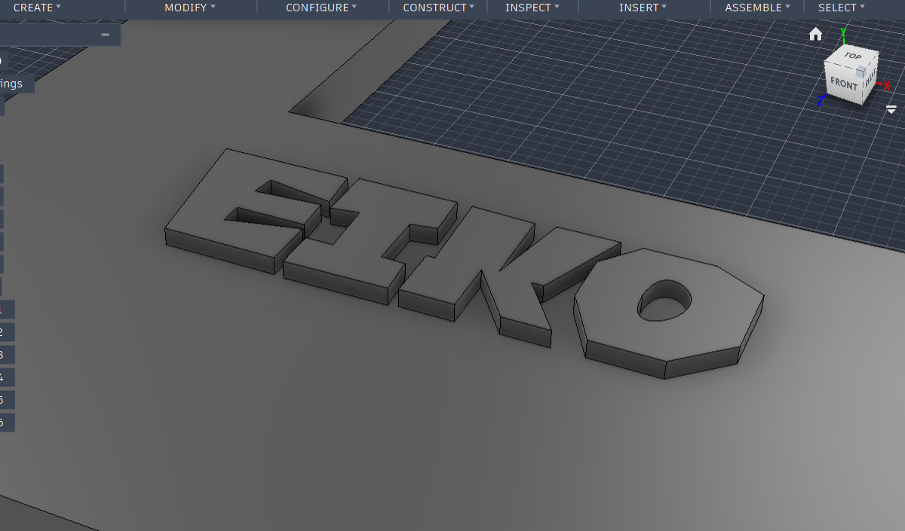

# Day 1: Starting with schematics!

I want to build a wiggly cam (quad cameras inspired by k4mera).

I have made some PCBs before but nothing this complex, so it was a huge learning experience for me. 

[I FORGOT TO LAPSE THE FIRST 30 MINS AAAA]

For day 1, I roughed out the schematics:
* 4 camera connectors (cam1-cam4)
* the Raspi CM4 module
* power section (USB-C + TP4056 charger + MT3608 boost converter)
* RGB LED flash section
* rotary encoders (2)
* an SD card slot

**Total time tracked: 1h4m**

# Day 2: finishing up schematics & ERC 
SO day 2 was just me fixing the billion erc errors i got

then, I worked on the CSI camera lanes on the CM4 module like it was kinda confusing trying to figure out where to put what.

IDK WHY IT TOOK 40 MINS i think im kinda dumb

(please spare me its FOUR CAMERAS im scared)

**Total time tracked: 41m**

# Day 3: switching to the Orange Pi CM4
I realised the RPi CM4 is not available in my country to buy + its VERY expensive. I tried finding the cheapest alternative, and i settled for the Orange Pi CM4.

I spent the session googling the pinout and figuring out how its different from RPi CM4. AND trying to find the symbols/footprints for it.

its kinda similar but some signals are in different places and the naming is also kinda different. 

**Total time tracked: 23m**

# Day 4: ERC + Footprints

Fixing ERC errors and assigning footprints.

UHHH so idk IT WAS PRETTY MUNDANE; mostly just me talking to ai about the erc errors

then  i googled the footprints and downloaded them and stuff, which was really boring/easy but time consuming

SCHEMATICS ARE DONE!!!! PCB layout time (the scary part :fear:)

**Total time tracked: 23m**

# Day 5: PCB TIME

I started by fixing up the schematics a bit.

THEN WE GET TO THE PCB LAYOUT!
I spent a good portion of my time googling the dimensions of some of my components (AGAIN, IM NEW TO HARDWARE; NOT SURE IF THIS IS THE RIGHT WAY TO DO IT)

I tried laying them out and doing some uhhh maths??? (idk what im doing)

I KINDA ragequit along the way, I got a bit frustrated lol

The four cameras were kinda hard to figure out. It got too complex sob

**Total time tracked: 45m**

# Day 6: RESEARCHING PARTS

UHHHH HI JOURNAL!!

i got rid of the 4 camera thingies. I got bored/frustrated/annoyed at the eiiiiko idea + IT WAS EXPENSIVE AS HELL. i renamed it to eiko-cam.

I spent most of my time researching on parts and stuff.
By the end of this, i had a rough ROUGH final layout
**Total time tracked: 49m**

# Day 7: LED RING -- schematics + PCB!

So, since i got rid of the 4 camera system, the entire project was looking really lame, i lost motivation to finish this project.
At this point i thought a normal ass camera was too boring; i needed a cool gimmick.

I decided to add a 24bit led ring to it, so we can click cool pictures WITH led? how cool is that? very cool! (thank u journal ily)

I fixed up the schematics a bit first, then i got to laying it on the pcb out ALL OVER AGAIN AAAAAAa

AT THIS POINT, i was mostly done with the pcb, now for the fun part!!! (routing traces yayyyyyyyyyy)

**Total time tracked: 1h2m**

# Day 8: ROUTING TRACES
i love routing traces. very therapeutic. very fun. i love routing traces. did i mention i love routing traces? because i love routing traces.

so basically i routed traces and yeah thats what i did.

**Total time tracked: 38m**

# Day 9: ROUTING (more) TRACES
HI JOURNAL I ROUTED TRACES TODAY!?!?!?!

the ever-humble design rules checker:

**Total time tracked: 44m**

# Day 10: fixing drc errors (sob), starting CAD
so the main error was "Front solder mask aperture bridges items with different nets".

i trusted this friendly redditor from 2years ago, and reduced the soldermask expansion.

that did the trick and removed most errors. 

seeing 0 errors is SO satisfying.

then i looked up step files for my components so i can make my pcb, which would help me with cad.
AAAAAAAAAAAAA CAD I DONT WANNA DO CAD IM SO BAD AT CAD IM DREADING IT SO  MUCH

**Total time tracked: 1h3m**

# Day 11: CAD AAAAAA HELP
i started with cad, just so you know, I SUCK AT CAD. i was dreading this all along. im SO scared of cad. 

anyway, while making this i just kinda did whatever, i made a box and kindaaa followed hackpad tutorial.
I wanted the main hole to be shaped like a sun, so i tried to find a sun dxf but it was REALLY bad, i tried fixing it, but i eventually gave up

then, i made something KINDA cool looking at the end BUT i didnt account for the rgb ring, so i have to redo it tmrw.

**Total time tracked: 1h1m**

# Day 12: CAD AAAAAA HELP
I wanted the rgb ring to have some sort of cool pattern instead of regular holes, so i decided to make the holes star shaped

unfortunately im a chud and horrible at cad, so i couldnt figure out how to resize the star to exact dimensions.

i looked it up and figured it out, but NOW i didnt know how to move the imported svg sketch

SO, I MADE THE STAR A BODY THAT I COULD MOVE AROUND

am i smart or am i a dumb idiot
pls dont answer that im embarrassed

**Total time tracked: 1h1m**

# Day 13: when will the suffering end (cad)
so i finished making the holes for the rgb, NO CLUE if its gna work, but i did it and thats all that matters :>

i have to put in more holes after, i only put 4 so far, but thats something ill figure out tomorrow (hopefully)

i tried making the top plate, and making an assembly to see if everything fits together

**Total time tracked: 25m**

# Day 14: most embarrassing cad sesh of all time
so im coming back to this proj after a LONG time. anyway, i just want to finish this proj asap cuz i have exams & sunbeam coming up and i need to get my stipeds before the deadline

i tried to do something different, I HAVE NO CLUE if it is practical, i think it is BUT IT LOOKS KINDA BAD

so i initially tried to put circles + stars to hold the circle hole thingy together

and i wasnt sure if it was practical, so i changed it to rectangles

then i wasnt sure if THIS was practical either, so i changed the entire thing to just rectangle, it looks ugly in cad, but i think itll look fine irl

then i started with the top plate, but ragequit like i always do waaa :0

PS: Lapse bugged and saved this project to the wrong hackatime Project!!!!!! 
[Link to lapse](https://lapse.hackclub.com/timelapse/Y-OtEQbrefqc)

**Total time tracked: 1h25m**

# Day 15: DONE WITH CAD!!!!
I finished the top plate! 
For the main body, i tried making it a bit better looking, it still looks weirddddd but its alright i guess. I tried making an angled extrusion but i couldnt figure out how that worked

For the top plate, i tried to find a cool font for branding, that took a while and finally decided to make a logo thing for eiko myself on figma. I exported that as an svg and YAY

THEN I finished the BOM, (its on lapse as eiko [16]) which surprisingly didnt take that long.

# Day 17: Finishing touches, assembly and renders
It took SO LONG trying to render everything AND make it look good. it still doesnt look good. im not proud of it. I completely changed the color scheme which i MIGHT regret when i get up. ok i think i regret it already. 

update: while writing this journal, i changed the colors to dark gray and white and it looks SO much cuter, im keeping this. (it took 30 mins and i didnt lapse it cuz i thought itd take 2 mins)

i think im super proud abt how it turned out now :3

i want to make my readme super cool

now for the part im like REALLY sucky at...